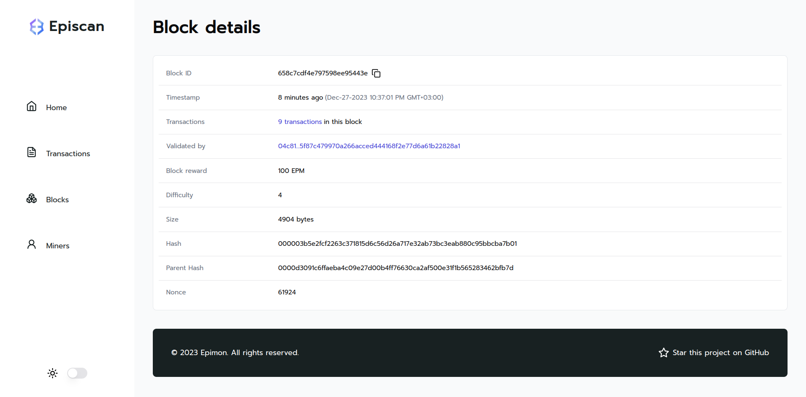

<h3 align="center">EPIMON</h3>

A cryptocurrency blockchain simulation, featuring blockchain nodes, a rich explorer and the wallet extension.

## Table of Contents

- [Overview](#overview)
- [Projects](#projects)
- [Contributing](#contributing)
- [License](#license)

## Overview

Epimon is a cryptocurrency blockchain simulation designed for developers who want to understand, test, and enhance the fundamental principles of blockchain technology.

Epimon comprises five main projects, each focusing on different feature sets. Below is a brief description of each project:

1. [**Blockchain**](#1-blockchain): This project is the backbone of the Epimon, handling essential blockchain operations. It verifies transactions for integrity and plays a key role in creating new blocks within the blockchain.
2. [**Wallet**](#2-wallet): This is a Chrome extension project that lets you do transactions, check your wallet balance, and more on the blockchain.
3. [**Node**](#3-node): Essential in preserving blockchain integrity, nodes verify and secure the network while mining blocks. Through this process, miners not only validate transactions but also earn EPM coins, ensuring the stability and immutability of the blockchain.
4. [**Episcan Web**](#4-episcan-web): This project empowers users to explore transactions, blocks, and wallet addresses within the blockchain seamlessly. It provides a user-friendly interface for in-depth examination of the blockchain network, allowing users to track various activities on the blockchain.
5. [**Episcan API**](#5-episcan-api): Developed specifically for the Episcan project, this API integrates with the main blockchain API to provide essential functionalities.

The combination of these projects gives users a practical understanding of how blockchains work. Epimon is an open-source project and welcomes contributions from developers.

## Projects

### 1. [Blockchain](https://github.com/canccevik/epimon/tree/main/apps/blockchain)

The Blockchain project serves as the foundational structure of Epimon. At its core, it meticulously verifies transactions to confirm their authenticity, ensuring a secure and tamper-proof record. Beyond this, the project is pivotal in the consistent creation and addition of new blocks to the blockchain. This ensures a continuous and trustworthy ledger of all activities within the system, underpinning the reliability and integrity of Epimon's operations.

**Tech stack:**

- [NestJS](https://github.com/nestjs/nest)
- [MongoDB](https://github.com/nestjs/mongoose)
- [Socket.io](https://www.npmjs.com/package/@nestjs/platform-socket.io)
- [Axios](https://github.com/axios/axios)
- [Bip39](https://github.com/iancoleman/bip39)
- [Elliptic](https://github.com/indutny/elliptic)
- [Swagger](https://github.com/nestjs/swagger)
- [Envalid](https://github.com/af/envalid)

### 2. [Wallet](https://github.com/canccevik/epimon/tree/main/apps/wallet)

The Wallet project is a Chrome extension designed for easy use with Epimon. With this tool, users can effortlessly make transactions, keep an eye on their wallet balances, and perform other essential tasks directly within the blockchain system, all in a user-friendly manner.

**Tech stack:**

- [React](https://github.com/facebook/react)
- [Vite](https://github.com/vitejs/vite)
- [React Router](https://github.com/remix-run/react-router)
- [CRXJS](https://github.com/crxjs/chrome-extension-tools)
- [Bip39](https://github.com/iancoleman/bip39)
- [Elliptic](https://github.com/indutny/elliptic)
- [Shadcn UI](https://github.com/shadcn-ui/ui)
- [Tailwind CSS](https://github.com/tailwindlabs/tailwindcss)
- [SWR](https://github.com/vercel/swr)
- [Zod](https://github.com/colinhacks/zod)

**Screenshots:**

### 3. [Node](https://github.com/canccevik/epimon/tree/main/apps/node)

The Node serves as a vital participant within the blockchain network. By actively engaging in its operations, it plays a crucial role in upholding the network's integrity. Additionally, the Node is responsible for overseeing and orchestrating the block mining process, ensuring that each transaction is processed securely and efficiently.

**Tech stack:**

- [NestJS](https://github.com/nestjs/nest)
- [NestJS Socket.io Client](https://github.com/blockcoders/nestjs-io-client)
- [Axios](https://github.com/axios/axios)
- [Bip39](https://github.com/iancoleman/bip39)
- [Elliptic](https://github.com/indutny/elliptic)
- [Envalid](https://github.com/af/envalid)

### 4. [Episcan Web](https://github.com/canccevik/epimon/tree/main/apps/episcan-web)

This project is designed to simplify blockchain for users. With its straightforward layout, anyone can easily view transactions, inspect blocks, and manage their wallet. Whether you're new to blockchain or experienced, this tool offers a user-friendly experience for all.

**Tech stack:**

- [Next.js](https://github.com/vercel/next.js)
- [Next Themes](https://github.com/pacocoursey/next-themes)
- [Shadcn UI](https://github.com/shadcn-ui/ui)
- [Tailwind CSS](https://github.com/tailwindlabs/tailwindcss)
- [SWR](https://github.com/vercel/swr)
- [Zod](https://github.com/colinhacks/zod)

**Screenshots:**

### 5. [Episcan API](https://github.com/canccevik/epimon/tree/main/apps/episcan-api)

This API has been exclusively crafted for the Episcan project, leveraging the core features of the main blockchain API. This integration, it aims to address and fulfill all the specific requirements and functionalities that Episcan demands.

**Tech stack:**

- [NestJS](https://github.com/nestjs/nest)
- [Axios](https://github.com/axios/axios)
- [Swagger](https://github.com/nestjs/swagger)
- [Envalid](https://github.com/af/envalid)

## Contributing

1. Fork this repository.
2. Create a new branch with feature name.
3. Create your feature.
4. Commit and set commit message with feature name.
5. Push your code to your fork repository.
6. Create pull request.

## License

Epimon is [MIT licensed](https://github.com/canccevik/epimon/blob/main/LICENSE).
